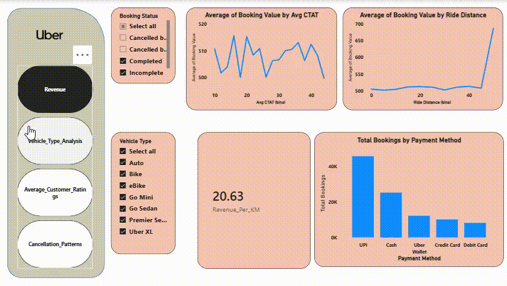

# 🚗 Uber Ride Operations: Operational Efficiency & Revenue Leakage Analysis

## 📊 Executive Dashboard Preview


## 📌 Project Overview & Business Problem
A standard taxi operations team is bleeding revenue due to a massive, systemic **~38% cancellation rate** across its entire multi-channel infrastructure. 

The goal of this end-to-end data analytics project is to act as a Strategic Operations Analyst to diagnose the root causes of cancellation behaviors, map supply-demand velocity across peak hours, analyze customer sentiment, and calculate exact revenue leakages to provide data-driven operational solutions.

---

## 🛠️ Tech Stack & Architecture
* **Data Extraction & Auditing**: Python (Pandas, NumPy, Scikit-Learn)
* **Business Intelligence & Core Analytics Engine**: Power BI Desktop (Advanced DAX, Power Query)
* **UI/UX Framework**: Customized Native App Sidebar Layout
* ## 🚀 Getting Started & Data Replication
To clone this project, run the local data audit pipeline, or interact with the operational database structure, follow these explicit instructions:

1. **Clone the Repository**:
   ```bash
   git clone https://github.com
   cd uber-ride-operations-analytics
   ```

2. **Acquire the Raw Transaction Ledger**:
   * Due to file size storage constraints, the raw transactional ledger is hosted externally.
   * Download the base tracking dataset directly from the official [Kaggle Uber Ride Analytics Dataset 2024](https://kaggle.com).
   
3. **Configure the Project Root**:
   * Move the downloaded source CSV into the same root folder on your local machine where your project scripts are stored.
   * Rename the source CSV file exactly to **`datase.csv`** to mirror the exact loading call on row 5 of the processing pipeline.

4. **Execute the Audit Engine**:
   * Launch your Jupyter notebook environment and run **`Uber Data Analytics.ipynb`** to process descriptive summaries and execute data quality validations.
   * Open the **`Personal_Project_Uber_Analysis.pbix`** file inside Power BI Desktop to view the operational dashboards and run dynamic DAX metrics.


---

## 🔍 Data Quality Audit & Validation (Python Phase)
Before building the visual presentation layer, a rigorous row-level programmatic data audit was conducted on over **148,000 transaction records**. This phase exposed a major real-world dilemma: **The external dataset documentation was completely flawed.**

### Core Auditing Discoveries:
1. **The Documentation Flaw**: The dataset's Kaggle landing page documentation claimed that the "Auto" category held 12.88M bookings with a 91.1% success rate. The python data audit exposed that the actual ledger holds a cleaner sample size of ~6K Auto bookings with a **61.8% success rate**. 
2. **The Revenue True Share (45.03%)**: External summaries cited a flat 40% revenue share for UPI. Cross-tabulating `Payment Method` against `Booking Status` revealed that approximately 9% of revenue-generating rides were flagged as `Incomplete` (rides aborted halfway where partial fares were still legally charged). By accurately factoring in realized revenue instead of blindly dividing by total booking volumes, the true market share for **UPI was proven to be 45.03%**.

```python
# Programmatic Validation Code Snippet used during audit
completed_rides = df1[df1['Booking Status'] == 'Completed']
rev_dist = df1.groupby('Payment Method')['Booking Value'].sum()
print("Direct Ledger Aggregation Share:\n", (rev_dist / rev_dist.sum()) * 100)
# Output: UPI = 45.03%, Cash = 24.87%, Uber Wallet = 11.96%
```

---

## 💡 Key Strategic Insights & Analytics Breakdown

### 1. The Omni-Channel Cancellation Patterns
* **The Structural Benchmark**: Cancellations are not isolated to specific vehicle fleets. Every category—from low-cost *Bikes* to premium *Uber XL*—suffers from an identical **61% to 62% success rate**. This proves a systemic dispatch or supply matching issue rather than driver-segment deficiencies.
* **The Root Causes**: Customer-initiated cancellations are split perfectly across four distinct core variables: *Wrong Address* (22.50%), *Change of plans* (22.41%), *Driver not moving* (22.24%), and *Driver asking to cancel* (21.86%). 

### 2. Vehicle Fleet & Metric Anomalies
* **Distance Elasticity**: Continuous variable data binning exposed a fascinating anomaly: Every single vehicle class yields a identical average trip distance of **24.5 to 25.1 km**. Customers are utilizing two-wheelers (Bikes/eBikes) for the exact same long-haul transit windows as Sedans, indicating zero product-use segmentation by distance.

### 3. Customer Satisfaction & The "Rating Ceiling"
* **The Sentiment Gap**: Customer ratings are consistently high across all fleets (**4.40–4.41**), while Driver ratings are structurally compressed (**4.23–4.24**). 
* **The Floor Effect**: Statistical range checking (`.describe()`) confirmed that zero ratings fall below a 3.0 threshold. To expose true operational sensitivities, the Power BI Y-axis was dynamically adjusted to start at 4.0, revealing that customer satisfaction significantly dips during late-evening periods where average driver wait times (`Avg_VTAT`) scale upwards.

---

## 🚀 Data-Driven Action Recommendations
1. **Optimize High-Traffic Bottlenecks**: Since driver wait times significantly correlate with minor drops in customer sentiment, routing algorithms should prioritize geometric clustering during peak rush hours to pull wait times below the current 8.5-minute average.
2. **Address Dispatch Mechanics**: Given that drivers are cancelling 25% of their rides due to "Capacity Issues" uniformly across standard categories, booking prompts should include explicit baggage/passenger verification constraints prior to dispatch.
3. **Address the "Driver Not Moving" Friction**: This issue is responsible for 22.24% of customer cancellations. Uber operations should introduce an automated app trigger that automatically reassigns a vehicle if a driver remains static for more than 180 seconds post-acceptance.

---

## 📁 Repository Structure
```text
├── Uber Data Analytics.ipynb   # Comprehensive Python verification, descriptive statistics, and logic checks.
├── Personal_Project_Uber_Analysis.pbix    # Fully configured Power BI file featuring Star Schema modeling, dynamic DAX measures, and app-like UI styling.
└── dashboard_demo.gif         # 30-second high-resolution interface walk-through demonstrating dynamic filtering states.
```
